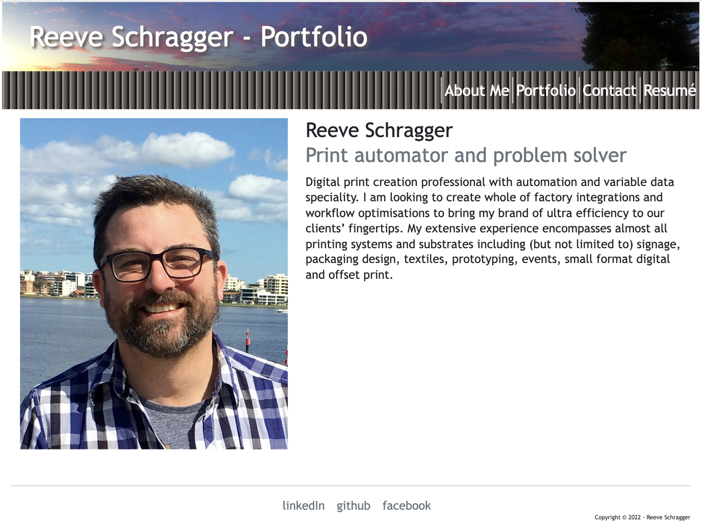

# BC20-React_Portfolio

  ## Description
  
  
  
  A portfolio of Reeve Schragger's work written using Reactjs

  Github Repo: https://github.com/rschragger/BC20-React_Portfolio

  This has been deployed to both: 
 Github pages: https://rschragger.github.io/BC20-React_Portfolio/  
 Heroku: https://rs-my-folio.herokuapp.com/

 ### Screenshots
 
 
  
  ## Table of Contents
  
  - [Installation](#installation)
  - [Usage](#usage)
  - [Credits](#credits)
  - [License](#license)
  - [Features](#features)
      - [Contributions](#contributions)
  - [Tests](#tests)
  - [Questions](#questions)
      - [Contacts](#contacts)
  
  ## Installation
   
  Installation Instructions: Navigate to either https://rschragger.github.io/BC20-React_Portfolio/ or https://rs-my-folio.herokuapp.com/ and follow links to get information
  
  ## Usage
   
  Usage Instructions: Follow links to get information
  
  ## Credits

###  Languages
- HTML
- CSS
- JavaScript
- React
- Node

###  Third Party Assets
- bootstrap
- gh-pages
- react
- react-dom
- react-scripts
- web-vitals
- emailjs/browser

  
###  Tutorials
- https://getbootstrap.com/docs
- https://stackoverflow.com/
- https://reactjs.org/docs
- https://www.emailjs.com/docs
- https://medium.com/

  
  ## License
   
  This application is licensed under Creative Commons - CC0
  
  ## Features
   
  
  ### Contributions
   
  Contribution guidelines: Student work
  
  ## Tests
  
  
  
  ## Questions
   
  
  ### Contacts
   
  You can reach me for additional questions at:
  - Email: [reeveschragger@gmail.com](mailto:reeveschragger@gmail.com)

  - GitHub: [rschragger GitHub page](https://github.com/rschragger)

  
  

  &copy; Copyright 2022 Reeve Schragger

  